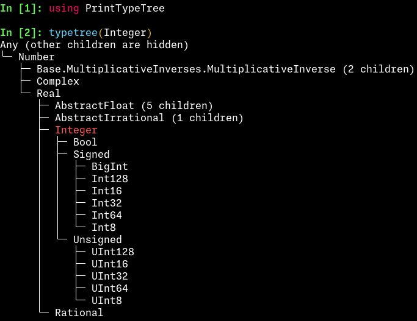

# PrintTypeTree

[](https://github.com/qiaojunfeng/PrintTypeTree.jl/actions/workflows/CI.yml?query=branch%3Amain)

Print a type hierarchy tree of a Julia type.

## Installation

```julia
using Pkg
Pkg.add("PrintTypeTree")
```

## Usage

```julia
using PrintTypeTree
typetree(Integer)
```


## Notes

Different from [`TypeTree.jl`](https://github.com/cnaak/TypeTree.jl), this is
targeted at the convenience of REPL usage: the function `typetree(T)` directly
prints the type tree of a type `T` to the console, including:
- all the subtypes of `T`, recursively
- the supertypes of `T` until `Any`
- except the branch of `T`, the type tree of the children of the supertypes are
    folded, but annotated with a visual cue of `(n children)` for those
    having `n` > 0 children
- the children of `Any` are hidden, and annotated with `(other children are hidden)`,
    to avoid printing too many types
- the type `T` is highlighted in red
